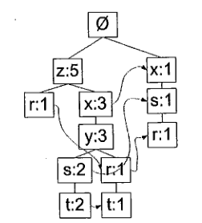
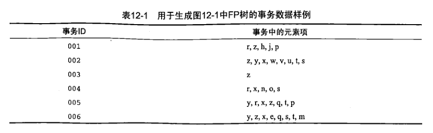

# 搜索引擎自动联想
关联性。比Apiori要快。

# FP树

上图中，元素项z右边标识的是5,说明元素项z出现了5次，集合{r,z}出现了一次，于是得到结论：z一定是自身或者和其他符号一起出现了4次。
再看z的其他可能性，集合{t,s,y,x,z}出现了2次，集合{t,r,y,x,z}出现了1次，所以它一定单独出现过1次。
再看下表：

事务数据集中005号记录上却是{y,r,x,z,q,t,p}。那pq怎么在FP树上不见了？
与 **支持度** 有关。该指标对应一个最小阈值，低于最小阈值的都是不频繁的元素项，不会在FP树中出现。
