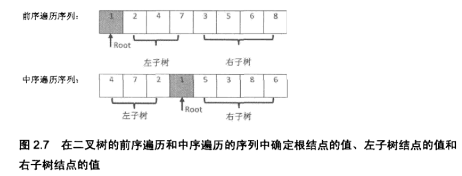

# 题目
输入某二叉树的前序遍历和中序遍历的结果，请重建出该二叉树。假设输入的前序遍历和中序遍历的结果中都不含重复的数字。例如输入前序遍历序列{1,2,4,7,3,5,6,8}和中序遍历序列{4,7,2,1,5,3,8,6}，则重建二叉树并返回。

# 思路

  1.先求出根节点（前序序列第一个元素）。 
  2.将根节点带入到中序遍历序列中求出左右子树的中序遍历序列。 
  3.通过左右子树的中序序列元素集合带入前序遍历序列可以求出左右子树的前序序列。 
  4.左右子树的前序序列第一个元素分别是根节点的左右儿子 
  5.求出了左右子树的4种序列可以递归上述步骤


```c++
/**
 * Definition for binary tree
 * struct TreeNode {
 *     int val;
 *     TreeNode *left;
 *     TreeNode *right;
 *     TreeNode(int x) : val(x), left(NULL), right(NULL) {}
 * };
 */
class Solution {
public:
    struct TreeNode* reConstructBinaryTree(vector<int> pre,vector<int> in) {
        //判定递归终止条件；
        if(pre.size() == 0 || in.size() == 0) {
            return NULL;
        }
        //定义Node节点并其求根节点；
        int root = pre[0];
        TreeNode* node = new TreeNode(root);
        vector<int>::iterator it;
        //1.求左右子树的遍历序列；
        vector<int> preLeft, preRight, inLeft, inRight;
            //（1）.求根节点在中序遍历序列中的位置；
        vector<int>::iterator i;
        for(it = in.begin(); it != in.end(); it++) {
            if(root == *it) {
                i = it;
            }
        }
            //（2）.求左右子树的中序遍历子序列；
        int k = 0;
        for(it = in.begin(); it != in.end(); it++) {
            if(k == 0) {
                inLeft.push_back(*it);
            }
            else if(k == 1) {
                inRight.push_back(*it);
            }
            else {}
            if(it == i) {
                k = 1;
            } //?????it==i时的这个it，也被push_back了！！！
        }
            //（3）.求左右子树的前序遍历子序列；
        k = 0;
        vector<int>::iterator ite;
        for(it = pre.begin()+1; it != pre.end(); it++) {
            for(ite = inLeft.begin(); ite != inLeft.end(); ite++) {
                if(*it == *ite) {
                    preLeft.push_back(*it);
                    k = 1;
                }
            }
            if(k == 0) {
                preRight.push_back(*it);
            }
            k = 0;
        }
        //根据遍历序列求出跟的左右节点；
        node->left = reConstructBinaryTree(preLeft,inLeft);
        node->right = reConstructBinaryTree(preRight,inRight);
        //返回节点地址；
        return node;
    }
};
```

# 解决
链接：https://www.nowcoder.com/questionTerminal/8a19cbe657394eeaac2f6ea9b0f6fcf6
来源：牛客网

```java
public class Solution {
    public TreeNode reConstructBinaryTree(int [] pre,int [] in) {
        TreeNode root=reConstructBinaryTree(pre,0,pre.length-1,in,0,in.length-1);
        return root;
    }
    //前序遍历{1,2,4,7,3,5,6,8}和中序遍历序列{4,7,2,1,5,3,8,6}
    private TreeNode reConstructBinaryTree(int [] pre,int startPre,int endPre,int [] in,int startIn,int endIn) {
         
        if(startPre>endPre||startIn>endIn)
            return null;
        TreeNode root=new TreeNode(pre[startPre]);
         
        for(int i=startIn;i<=endIn;i++)
            if(in[i]==pre[startPre]){
                root.left=reConstructBinaryTree(pre,startPre+1,startPre+i-startIn,in,startIn,i-1);
                root.right=reConstructBinaryTree(pre,i-startIn+startPre+1,endPre,in,i+1,endIn);
            }
                 
        return root;
    }
}
```

# 我的解决方案

参考http://wiki.jikexueyuan.com/project/for-offer/question-six.html,与上面的类似。主要是控制递归的起点和终点。

[查看代码](./重建二叉树.py)

# 根据前序中序求后序

```c++
#include <iostream>  
#include <fstream>  
#include <string>  
  
struct TreeNode  
{  
  struct TreeNode* left;  
  struct TreeNode* right;  
  char  elem;  
};  
  
  
TreeNode* BinaryTreeFromOrderings(char* inorder, char* preorder, int length)  
{  
  if(length == 0)  
    {  
      return NULL;  
    }  
  TreeNode* node = new TreeNode;//Noice that [new] should be written out.  
  node->elem = *preorder;  
  int rootIndex = 0;  
  for(;rootIndex < length; rootIndex++)//a variation of the loop  
    {  
      if(inorder[rootIndex] == *preorder)  
      break;  
    }  
  node->left = BinaryTreeFromOrderings(inorder, preorder +1, rootIndex);  
  node->right = BinaryTreeFromOrderings(inorder + rootIndex + 1, preorder + rootIndex + 1, length - (rootIndex + 1));  
  std::cout<<node->elem<<std::endl;  
  return node;  
}  
  
int main(int argc, char** argv){  
    char* pr="GDAFEMHZ";      
 char* in="ADEFGHMZ"; BinaryTreeFromOrderings(in, pr, 8); printf("\n"); return 0;}  
 ```