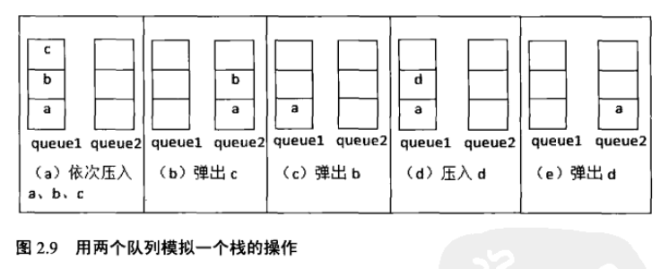

# 题目 

用两个栈来实现一个队列，完成队列的Push和Pop操作。 队列中的元素为int类型。

《剑指Offer》原题如下：


# 思路


```c++
template<typename T> void CQueue<T>::appenTail(const T& element)
{
    stack1.push(element);
}

template<typename T> T CQueue<T>::deleteHead()
{
    if(stack2.size()<=0)
    {
        while(stack1.size()>0)
        {
            T& data = stack1.top();
            stack1.pop();
            stack2.push(data);
        }
    }

    if(stack2.size()==0)
    {
        throw new exception("queue is empty!");
    }

    T head = stack2.top();
    stack2.pop();
    return head;
}
```

# 发散
用两个队列模拟一个栈的操作

