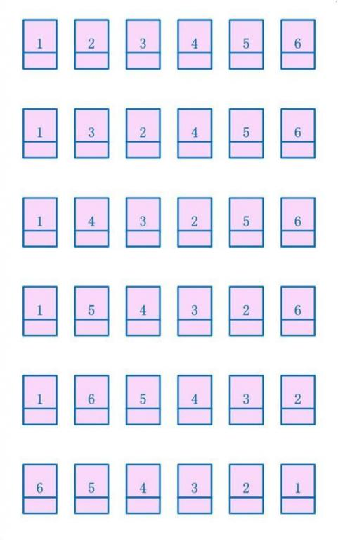

# 题目

输入一个链表，反转链表后，输出链表的所有元素。


# References
* http://blog.csdn.net/feliciafay/article/details/6841115
方法1：将单链表储存为数组，然后按照数组的索引逆序进行反转。

方法2：使用3个指针遍历单链表，逐个链接点进行反转。

方法3：从第2个节点到第N个节点，依次逐节点插入到第1个节点(head节点)之后，最后将第一个节点挪到新表的表尾。


```c
    p=head->next;  
    while(p->next!=NULL){  
        q=p->next;  
        p->next=q->next;  
        q->next=head->next;  
        head->next=q;  
    }  
```
方法4:   递归(相信我们都熟悉的一点是，对于树的大部分问题，基本可以考虑用递归来解决。但是我们不太熟悉的一点是，对于单链表的一些问题，也可以使用递归。可以认为单链表是一颗永远只有左(右)子树的树，因此可以考虑用递归来解决。或者说，因为单链表本身的结构也有自相似的特点，所以可以考虑用递归来解决)

```c++
struct ListNode{  
    int val;  
    ListNode* next;  
    ListNode(int a):val(a),next(NULL){}  
};  
  
class Solution{  
     ListNode* reverseLinkedList4(ListNode* head){ //输入: 旧链表的头指针  
        if(head==NULL)  
            return NULL;  
        if(head->next==NULL){  
            m_phead=head;  
            return head;  
        }  
        ListNode* new_tail=reverseLinkedList4(head->next);  
        new_tail->next=head;  
        head->next=NULL;  
        return head; //输出: 新链表的尾指针  
     }  
    ListNode* m_phead=NULL;//member variable defined for reverseLinkedList4(ListNode* head)  
};  
```


```cpp
struct ListNode{  
    int val;  
    ListNode* next;  
    ListNode(int a):val(a),next(NULL){}  
};  
  
class Solution{  
    ListNode* reverseLinkedList5(ListNode* head, ListNode* & new_head){ //输入参数head为旧链表的头指针。new_head为新链表的头指针。  
        if(head==NULL)  
            return NULL;  
        if(head->next==NULL){  
            new_head=head; //当处理到了旧链表的尾指针，也就是新链表的头指针时，对new_head进行赋值。因为是引用型参数，所以在接下来调用中new_head的值逐层传递下去。  
            return head;  
        }  
        ListNode* new_tail=reverseLinkedList5(head->next,new_head);  
        new_tail->next=head;  
        head->next=NULL;  
        return head; //输出参数head为新链表的尾指针。  
    }  
};  
```