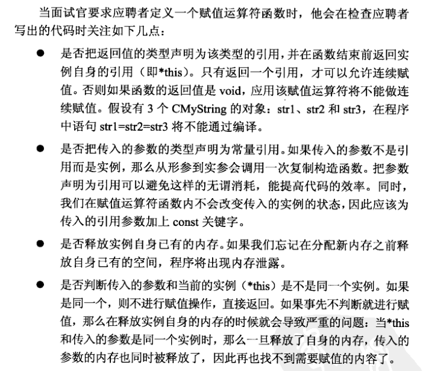

# 题目

如下为类型CMyString的声明，为该类型添加赋值运算符函数

```c++
class CMyString
{
    public:
        CMyString(char* pData=NULL);
        CMyString(const CMyString& str);
        ~CMyString(void);
    private:
        char* m_pData;
}
```



# 初级

已经够用~~~

```c++
CMyString& CMyString::operator =(const CMyString &str)
{
    if(this==&str)
        return *this;
    delete []m_pData;
    m_pData = NULL;
    m_pData = new char[strlen(str.m_pData)+1];
    strcpy(m_pData,str.m_pData);
    return *this;
}
```

# 改进

```c++
CMyString& CMyString::operator =(const CMyString &str)
{
    if(this!=&str)
    {
        CMyString strTemp(str);

        char * pTemp = strTemp.m_pData;
        strTemp.m_pData = m_pData;
        m_pData = pTemp;
    }
    return *this;
}
```

# 测试用例
* 把一个CMyString的实例赋值给另外一个实例。
* 把一个CMyString的实例赋值给它自己。
* 连续赋值。