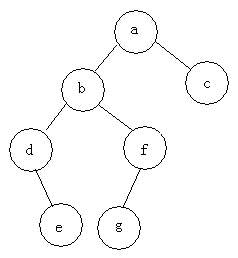

# 二叉树遍历方式介绍

- 前序遍历：根节点->左子树->右子树
- 中序遍历：左子树->根节点->右子树
- 后序遍历：左子树->右子树->根节点

* 前序遍历：abdefgc
* 中序遍历：debgfac
* 后序遍历：edgfbca

# References
- http://blog.csdn.net/fansongy/article/details/6798278
- http://blog.csdn.net/gatieme/article/details/51163010