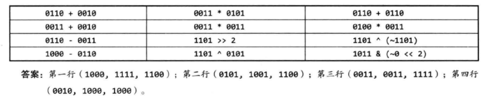
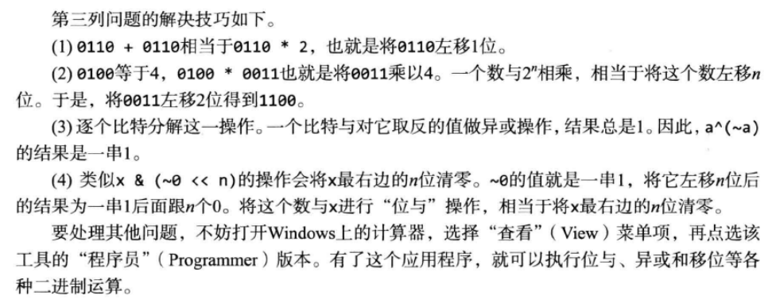

# 


## 解法1：左移输入数字，可能引起死循环

```cpp
int NumberOf1(int n)
{
    int count = 0;
    while(n)
    {
        if(n&1)count++;
        n = n>>1;
    }
    return count;
}
```

死循环的漏洞：对于负数左移，最高位的符号位并不会动！


## 解法2：左移模板，常规解法效率不高
```cpp
int NumberOf1(int n)
{
    int count = 0;
    unsigned int flag = 1;
    while(flag)
    {
        if(n&flag)count++;
        flag = flag<<1;
    }
    return count;
}
```


## 解法3：发现规律

把一个整数减去1，都是把最右边的1变成0（最右边的1，可能不在最右边~~~）。如果它的右边还有0，所有的0都变成1（借位）,而它左边所有位都保持不变。

接下来把一个整数和它减去1的结果做位与运算,相当于把它最右边的1变成0.

总结结果就是，上述的位与操作，能进行多少次，就取决于有多少个1.

```cpp
int NumberOf1(int n)
{
    int count = 0;
    while(n)
    {
        ++count;
        n = (n-1)&n;
    }
    return count;
}
```


# 附录：位操作






## 常见位操作

1. 获取

不为零说明i位为1， 否则为0：
```java
boolean getBit(int num, int i){
    return ( num & (1<<i) != 0) ;
}
```

2. 置位

```java
int setBit(int num, int i){
    return num | (1<<i);
}
```

3. 清零

```java
int clearBit(int num, int i){
    int mask = ~(1<<i);
    return num & mask
}
int clearBitMSBthroughI(int num, int i){
    int mask = (1<<i) - 1;
    return num & mask;
}
int clearBitsIthrough0(int num, int i){
    int mask = ~((1<<(i+1)) - 1);
    return num & mask;
}
```

4. 更新

将setBit和clearBit合二为一。

```java
int updateBit(int num, int i, int v){
    int mask = ~(1<<i);
    return (num&mask) | (v<<i); //只更新一个bit
}