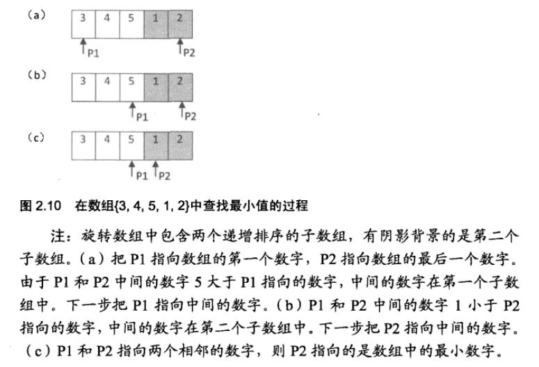
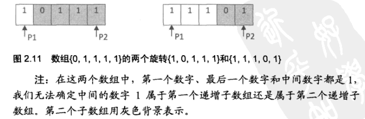

# 题目

把一个数组最开始的若干个元素搬到数组的末尾，我们称之为数组的旋转。
输入一个非递减排序的数组的一个旋转，输出旋转数组的最小元素。
例如数组{3,4,5,1,2}为{1,2,3,4,5}的一个旋转，该数组的最小值为1。
NOTE：给出的所有元素都大于0，若数组大小为0，请返回0。

# 思路


# 我的思路和答案
输入数组是分段“非递减”的，因此考虑分段截取，递归解决。可以解决，但是太低效。
```python
# -*- coding:utf-8 -*-
class Solution:
    def minNumberInRotateArray(self, rotateArray):
        # write code here
        length = len(rotateArray)
        if  length == 0:
            return 0
        if length == 1:
            return rotateArray[0]
        
        #small = rotateArray[0]
        for i in range(length-1):
            small = rotateArray[i]
            for j in range(i+1,length):
            	
                if rotateArray[j]<small:
                    #small = rotateArray[j]
					self.minNumberInRotateArray(rotateArray[j:])                   
        return small 
def main():
    sol = Solution()
    input = [3,4,5,1,2]
    result = sol.minNumberInRotateArray(input)
    print result
if __name__ == '__main__':
    main()
```


又改进了一个方案,主要是去掉了递归。
```python
# -*- coding:utf-8 -*-
class Solution:
    def minNumberInRotateArray(self, rotateArray):
        # write code here
        length = len(rotateArray)
        print length
        if  length == 0:
            return 0
        if length == 1:
            return rotateArray[0]
        i = 0
        step = 1
        while i<length-1:     		
            print i," "
            small = rotateArray[i]
            print "small",small
            for j in range(i+1,length):
                if rotateArray[j]<small:
                    small = rotateArray[j]
                    step = j-i
                    print "small update",small,"step",step
                    break
            i = i + step
        return small 
```

## 二分法的解


漏洞：两个指针下标对应的值相同，且中间数字也相同，我们会把中间值赋给第一个指针，但事实不一定如此。




考虑该问题后，可得：

```cpp
int Min(int * numbers, int length)
{
    if(numbers==NULL || length <= 0)
        throw new std::exception("");
    int index1 = 0;
    int index2 = length - 1;
    int indexMid = index1; 
    while(numbers[index1] >= numbers[index2])
    {
        if(index2-index1 == 1)
        {
            indexMid = index2;
            break;
        }

        indexMid = (index1+index2)/2;

        //如果下标为index1\index2\indexMid指向的三个数字相等，则只能顺序查找
        if(numbers[index1]==numbers[index2] && numbers[indexMid]==numbers[index1])
        {
            return MinInOrder(numbers,index1,index2);
        }
        if(numbers[indexMid] >= numbers[index1])
            index1 = indexMid;
        else if(numbers[indexMid] <= numbers[index2])
            index2 = indexMid;
    }
    return numbers[indexMid];
}

int MinInOrder(int* numbers,int index1,int index2)
{
    int result = numbers[index1];
    for(int i=index1+1; i<=index2; i++)
    {
        if(result>numbers[i])result = numbers[i];
    }
    return result;
}


```